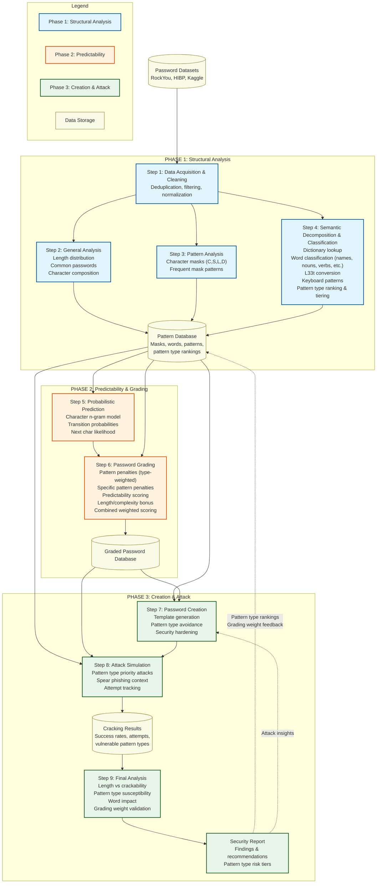

# Password-Analysis project

#### Group members:
| Group 1 | | Group 2 | |
| :--- | :--- | :--- | :--- |
| **Student Name** | **Student Number** | **Student Name** | **Student Number** |
| Ryan Eveson | 99775389 | Devin Huang | 86828886 |
| Joaquin Almora | 68642073 | Maria Sato | 14489231 |
| Phong Nguyen | 55533582 | Leila Saparbek | 
|| | Ali Afoud | 34031898 | 

---
### Phase 1: Structural Analysis
Objective is analysing the data of password, their patterns and more...

- **Step 1: dataset acquisition** Retrieving a password dataset from RockYou, HaveIbeenPwned, or Kaggle, and clean the data.

- **Step 2: General Analysis** Identifying common password and common lengths and variability of these parameters

- **Step 3: Password pattern** passwords into masks 
    - *e.g* `P@ss123` becomes `C S L L D D D` (Capital, Special, Lower, Lower, Digit...). 
    then analyse masking patterns that are most frequent in the password data

- **Step 4: Semantic decomposition** 
    - **Dictionary lookup:** finding common words that may appear in password, e.g: password, [city name], etc...
    - **Word classification:** categorizing found words into linguistic types (names, nouns, verbs, adjectives, places, dates, etc.) to identify which categories appear most frequently in passwords
    - **L33t detection:** reverse common numerical symbols used for alphabetical substitution, e.g: 3 would be E or e, 4 would be A or a, etc...
    - **Keyboard patterns:** check for pattern that already exist on keyboard: e.g: "qwerty" or "123poiuy"
    - **Pattern type ranking:** analyze and rank the most common pattern categories found, creating a tiered system where more frequent = more predictable

### Phase 2: Predictability
Now that we have some solid understanding on the data and its patterns, and overall probabilistic outcome we want to build a system that can grade our password or predict them 

- **Step 5: Probabilistic prediction** we want to look at the transition probability from character to character to see the likelihood of the next character based on the knowledge of existing one, think of an n-gram LM but instead of word by word its character by character 

- **Step 6: grading** With the above probabilistic prediction calculator, and also adding another script that notices common general patterns we can start grading and punishing users on their password input: 
    - **Pattern type penalties:** apply a weighted deduction system based on pattern type rankings from Step 4 - the more common the pattern category (names, nouns, common verbs), the more points deducted
    - **Specific pattern penalties:** e.g: if user does common pattern: "asdf" or [putting ! at end of a password] -10points, more common the pattern more points removed
    - **Predictability scoring:** the more predictable the characters are based on previous entry the lower the base grade
    - **Combined scoring:** final grade = base predictability score - pattern type penalties - specific pattern penalties + complexity/length bonuses

### Phase 3: password creation and attacking
While we have data and a grading system for password, now we can start making them. 

- **Step 7: creation** Create a script that based on all info and resources available can create passwords, we can feed it passwords we want, or elements we want and have it also edit them to become secure. The generator will incorporate knowledge of common pattern types to avoid them when creating strong passwords.

- **Step 8: Attack simulation** in similar fashion we can make a different script that uses the data we have collected, as well as **some** context fed into the creation script, to simulate a pattern based and spear phishing attack. The attack script now combines our ranked pattern seeds with the same `english-words` dictionary library used in earlier analysis steps, so the cracking run can test both project-specific patterns and a broader English word list. It will still prioritize the most common pattern types first (names, then nouns, etc.) based on our ranking from Phase 1 and record which passwords get cracked and in how many attempts.

- **Step 9: final analysis** if any of the password get cracked, we can use them and the number of attempt it took to analyse what kind of parameters made them more susceptible, was it length? simplicity? certain common words or patterns? We'll specifically analyze which pattern types proved most vulnerable and validate our grading weightings against actual cracking success rates.

---
### Credits:

the data originates from the RockYou2024.txt, which has then been cleanup and provided by **BwandoWando** on kaggle at : **https://www.kaggle.com/discussions/accomplishments/519395**
